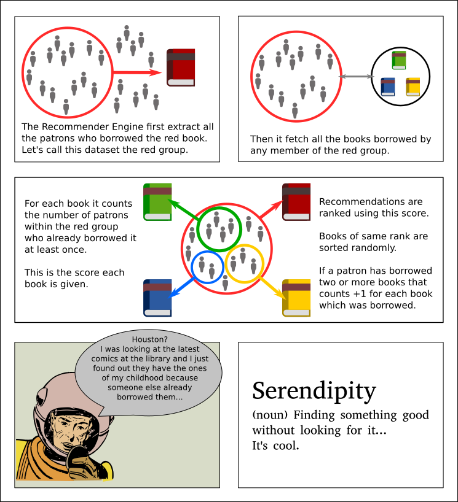

# KohaRecommenderEngine

This Koha Plugin is an attempt at creating a "crowd-sourced" recommendation engine. 
At the time of writing it is a collaborative-filtering based recommender system. 
Similar references are linked to each others by patron issues. 
It can easily be extended to support content based filters as well (have a look at the code). 

## How it works?
I made this little sketch to try to explain things.

## Want to learn more about Recommender Systems?
Here is a list of links about the theory beyond the code :
 * https://en.wikipedia.org/wiki/Recommender_system
 * https://en.wikipedia.org/wiki/Collaborative_filtering
 * http://ijcai13.org/files/tutorial_slides/td3.pdf

## To install the plugin
First you have to modify koha-conf.xml and set enableplugins to 1 (it is set to 0 by default). 
Then check in Koha Administration panel, search for the UseKohaPlugins variable, and set this to Enable. 
Finally go to the Reports panel and click on "Report Plugins". 
On the top left corner you'll see an "Upload a plugin" link, which will enable you to install the KPZ file. 

## How to use
Easy! Click on "Run report" and type in a biblionumber. 
You'll then be rewarded by a list of references which were top issued by patrons. 

## To Do
-Integrate into Opac (in progress!) 
-Fasten/Optimize query 
-Any other idea is welcome 
