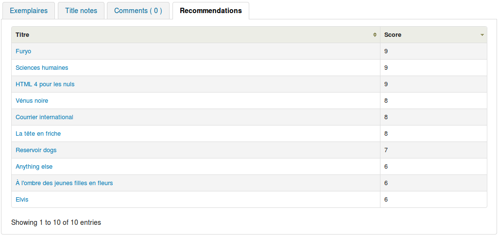

# KohaRecommenderEngine

This Koha Plugin is an attempt at creating a "crowd-sourced" recommendation engine.<br>
At the time of writing it is a collaborative-filtering based recommender system.<br>
Similar references are linked to each others by patron issues.<br>
It can easily be extended to support content based filters as well (have a look at the code).<br>

## How it works?
I made this little sketch to try to explain things.


## Want to learn more about Recommender Systems?
Here is a list of links about the theory beyond the code :
 * https://en.wikipedia.org/wiki/Recommender_system
 * https://en.wikipedia.org/wiki/Collaborative_filtering
 * http://ijcai13.org/files/tutorial_slides/td3.pdf

Here are some links more specifically about Recommender System in Libraries:
 * http://em.iism.kit.edu/research/projects/reckvk/index.php?language=en&id=Summary
 * https://core.ac.uk/display/19915480
 * http://onlinelibrary.wiley.com/doi/10.1002/meet.2011.14504801289/full
 * http://www.dlib.org/dlib/may08/monnich/05monnich.html
 * http://dl.acm.org/citation.cfm?doid=2637002.2637015

## To install the plugin
First you have to modify koha-conf.xml and set enableplugins to 1 (it is set to 0 by default).<br>
Then check in Koha Administration panel, search for the UseKohaPlugins variable, and set this to Enable.<br>
Finally go to the Reports panel and click on "Report Plugins".<br>
On the top left corner you'll see an "Upload a plugin" link, which will enable you to install the KPZ file.<br>

## Integration to OPAC
After installation of the plugin, you just need to click on "configure" and the Javascript code which enable OPAC integration is automatically added to OpacUserJS syspref.
When the plugin is uninstalled, this piece of code is automatically removed.
One more step is needed for the plugin to work, some part of the script has to be available publicly.
To permit this you have to add the following few lines in your Apache configuration file (most probably koha-httpd.conf).
Don't forget to modify the paths according to your koha installation.

```
  ScriptAlias /recommendations.pl "/home/koha/var/lib/plugins/Koha/Plugin/Com/Liliputech/RecommenderEngine/recommendations.pl"
  Alias /plugin "/var/lib/plugins"
  # The stanza below is needed for Apache 2.4+
  <Directory /home/koha/var/lib/plugins>
        Options Indexes FollowSymLinks
        AllowOverride None
        Require all granted
  </Directory>
```

If everything has been setup correctly you should get a new tab next to the "Comment" tab on Opac Details:


## How to use
If you have not integrated to Opac you could still use the plugin to generate lists of recommendations.
Easy! Click on "Run report" and type in a biblionumber.<br>
You'll then be rewarded by a list of references which were top issued by patrons.<br>

## To Do
- Fasten/Optimize query<br>
- Develop some configuration options<br>
- Enable handling of "Content-Based Filtering" techniques<br>
- Improve UI.<br>
- Any other idea is welcome<br>

## Greetings
- Kyle Hall who developped Koha Plugin functionnality and provided the community with running examples.
- Lyon 3 Koha Team for their "knowledge sharing" values and for giving me the necessary pre-requisite for having fun while coding in Perl and JS.

# FR - KohaRecommenderEngine

Ce plugin est une tentative d'implémentation d'un système de recommendation.<br>
Actuellement c'est un système assez basique de "Filtre Collaboratif".<br>
Les références bibliographiques sont liées les unes aux autres par les emprunts des usagers.<br>
Le code peut facilement être étendu pour prendre également en charge des filtres basés sur le contenu.<br>

## Comment ça marche?
J'ai fait cette petite bande-dessinée pour tenter d'expliquer le fonctionnement (pas encore traduite).


## En savoir plus sur les systèmes de recommendation
Quelques liens à propos de la théorie de fonctionnement des systèmes de recommendation:
 * https://fr.wikipedia.org/wiki/Recommender_system
 * https://fr.wikipedia.org/wiki/Collaborative_filtering
 * http://ijcai13.org/files/tutorial_slides/td3.pdf

Quelques liens plus spécifiques à propos de leurs usages en bibliothèques:
 * http://em.iism.kit.edu/research/projects/reckvk/index.php?language=en&id=Summary
 * https://core.ac.uk/display/19915480
 * http://onlinelibrary.wiley.com/doi/10.1002/meet.2011.14504801289/full
 * http://www.dlib.org/dlib/may08/monnich/05monnich.html
 * http://dl.acm.org/citation.cfm?doid=2637002.2637015

## Pour installer le plugin
En premier lieu vous devrez modifier le fichier "koha-conf.xml" et positionner la variable "enableplugins" à 1 (elle est à 0 par défaut).<br>
Ensuite rendez vous dans le module d'Administration de Koha, cherchez la variable "UseKohaPlugin" et positionnez là à "Enable".<br>
Pour finir, aller dans la partie "Rapports" et cliquez sur le lien "Plugins de rapports".<br>
Dans le coin supérieur gauche vous devriez alors voir un lien "Téléverser un plugin" ou "Upload a plugin", qui vous permettra d'installer le fichier ".KPZ".<br>

## Integration à l'OPAC
Après l'installation du plugin, il suffit de cliquer sur "configurer" pour qu'un code Javascript qui permet d'intégrer les recommendations sur l'OPAC soit ajouté à la syspref "OpacUserJS".<br>
Ce code est automatiquement supprimé lorsque le plugin est désinstallé.<br>
Une étape supplémentaire est nécessaire au fonctionnement du plugin, il faut ajouter les lignes suivantes à la configuration de votre serveur Apache (probablement dans le fichier koha-httpd.conf).<br>
N'oubliez pas d'éditer les chemins présents dans l'exemple conformément à votre installation de Koha.<br>

```
  ScriptAlias /recommendations.pl "/home/koha/var/lib/plugins/Koha/Plugin/Com/Liliputech/RecommenderEngine/recommendations.pl"
  Alias /plugin "/var/lib/plugins"
  # The stanza below is needed for Apache 2.4+
  <Directory /home/koha/var/lib/plugins>
        Options Indexes FollowSymLinks
        AllowOverride None
        Require all granted
  </Directory>
```

Si tout s'est pasé correctement vous devriez obtenir un nouvel onglet à la suite de l'onglet "Commentaires" sur la page opac-detail:


## To Do
- Optimiser la requète SQL<br>
- Ajouter des options de configurations<br>
- Permettre la prise en charge de filtres de contenus<br>
- Améliorer l'interface utilisateur.<br>
- Toutes les idées sont les bienvenues!<br>

## Remerciements
- Kyle Hall pour le développement des Plugins et les exemples fournis à la communauté.
- l'équipe Koha de l'Université Lyon 3 pour sa valorisation du partage des connaissances et pour m'avoir donné les prérequis nécessaires en Perl, JS et SQL.
